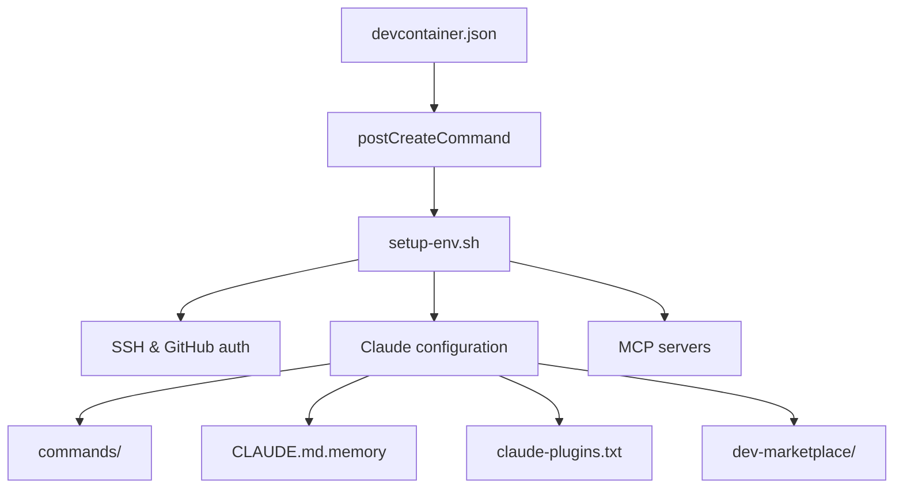

# CLAUDE.md

Standalone DevContainer for multi-AI agent development. Configures Claude Code and Gemini CLI with custom slash commands, MCP servers, plugins, and skills.

**Configuration-only repository** - no build, test, or lint commands.

## Architecture



| Source | Destination |
|--------|-------------|
| `.devcontainer/configuration/CLAUDE.md.memory` | `~/.claude/CLAUDE.md` |
| `.devcontainer/configuration/claude-plugins.txt` | plugin/skill manifest |
| `.devcontainer/commands/` | `~/.claude/commands/` |
| `.devcontainer/plugins/dev-marketplace/` | local marketplace |

## Environment Variables

| Variable | Required | Description |
|----------|----------|-------------|
| `GH_TOKEN` | Yes | GitHub PAT with `repo`, `workflow` permissions |
| `SSH_PRIVATE_KEY` | No | Base64-encoded SSH key for Git auth |
| `RESET_CLAUDE_CONFIG` | No | Clear `~/.claude/` on startup |
| `RESET_GEMINI_CONFIG` | No | Clear `~/.gemini/` on startup |

Codespaces: add as repository secrets. Local: create `.devcontainer/.env`.

## Plugins & Skills

Configured in `.devcontainer/configuration/claude-plugins.txt`:

```bash
plugin-name                                    # Official marketplace
plugin-name@marketplace=owner/repo             # External marketplace
skill-name@vercel-skills=vercel-labs/agent-skills  # Vercel skills
skill-name@github=owner/repo/path-to-SKILL.md  # GitHub direct
```

**Installed**: agent-sdk-dev, code-simplifier, commit-commands, feature-dev, frontend-design, ralph-loop, pyright-lsp, typescript-lsp, context7, ast-grep

**Skills**: vercel-react-best-practices, web-design-guidelines, agent-browser

### Local Marketplace

Directory `.devcontainer/plugins/dev-marketplace/` hosts plugins for development.

To add a plugin:
1. Create directory with `.claude-plugin/plugin.json`
2. Add entry to `.claude-plugin/marketplace.json`
3. Run `.devcontainer/setup-env.sh`

To update: bump version in `plugin.json` after changes.

## Slash Commands

Located in `.devcontainer/commands/`:

| Command | Description |
|---------|-------------|
| `/code-review` | Launch parallel code review agents |
| `/git-message` | Generate conventional commit messages |
| `/design-system` | Generate HTML design system templates |
| `/roadmap` | Generate or update ROADMAP.json |

## MCP Servers

| Server | Description |
|--------|-------------|
| `aws-documentation` | AWS docs search and reading |
| `terraform` | Terraform/Terragrunt workflow and AWS provider docs |
| `aws-api` | Execute AWS CLI commands |

## Installed Tools

| Tool | Command | Description |
|------|---------|-------------|
| agent-browser | `agent-browser` | CLI browser automation |
| ast-grep | `sg` | Structural code search using AST patterns |
| specify-cli | `specify` | GitHub Spec-Kit |
| openspec | `openspec` | OpenAPI spec generation |
| Gemini CLI | `gemini` | Google's AI CLI |

## Quick Reference

```bash
claude mcp list                                    # Verify MCP servers
claude plugin marketplace list                     # List installed plugins
claude plugin marketplace update claude-plugins-official  # Update plugins
./.devcontainer/setup-env.sh                       # Re-sync configuration
```
