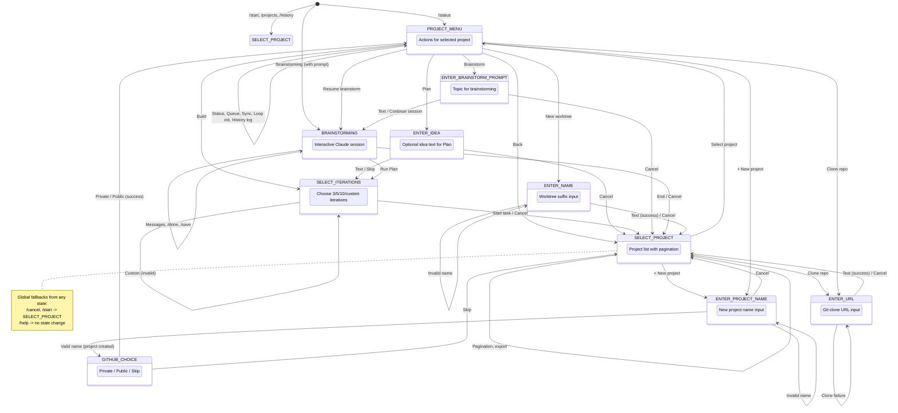

# Telegram Bot Commands

## Navigation

| Command | Description |
|---------|-------------|
| `/start` | Show project list and start navigation |
| `/projects` | Same as `/start` - show available projects |
| `/status` | Show status of all active tasks |

## Help

| Command | Description |
|---------|-------------|
| `/help` | Show bot usage instructions and available commands |

## Task Management

| Command | Description |
|---------|-------------|
| `/cancel` | Cancel current operation and return to start |
| `/skip` | Skip optional idea input when starting Plan mode |

## Brainstorming

| Command | Description |
|---------|-------------|
| `/brainstorming <prompt>` | Start interactive brainstorming session with Claude |
| `/done` | Finish brainstorming and save result to `docs/ROADMAP.md` |
| `/save` | Same as `/done` |
| `/history` | Show past brainstorming sessions (filtered by selected project) |

## Interactive Buttons

The bot uses inline keyboard buttons for most interactions:

### Project List
- **▸ Project** - Standalone repo
- **↳ Project** - Worktree
- **◉ Project** - Running task
- **◀ Prev** / **Next ▶** - Page navigation (shown when >5 projects)
- **+ New project** - Create a new project
- **↓ Clone repo** - Clone a git repository

### Project Menu
- **Plan** - Start planning mode
- **Build** - Start build mode
- **Brainstorm** - Start brainstorming session
- **New worktree** - Create new git worktree (any project)
- **Loop init** - Initialize loop in project (shown when loop not configured)
- **Status** - Show task status
- **Attach** - Get tmux attach command for running task
- **Queue** - View queued tasks
- **Sync** - Pull latest changes from remote (shows update count)
- **Back** - Go back to project list

### After Brainstorming
- **Run Plan** - Start Plan mode with saved roadmap
- **Finish** - End session without running Plan

## Conversation State Machine



## Usage Examples

### Start a task
```
/start
→ Select project
→ Click "Plan" or "Build"
→ Enter idea (or /skip)
→ Select iterations
```

### Brainstorming session
```
/brainstorming Add user authentication with MFA
→ Answer Claude's questions
→ /done
→ Click "Run Plan" or "Finish"
```

### Check running tasks
```
/status
```

### Attach to running session
```
/start
→ Select running project (◉ icon)
→ Click "Attach"
→ Copy tmux command
```
